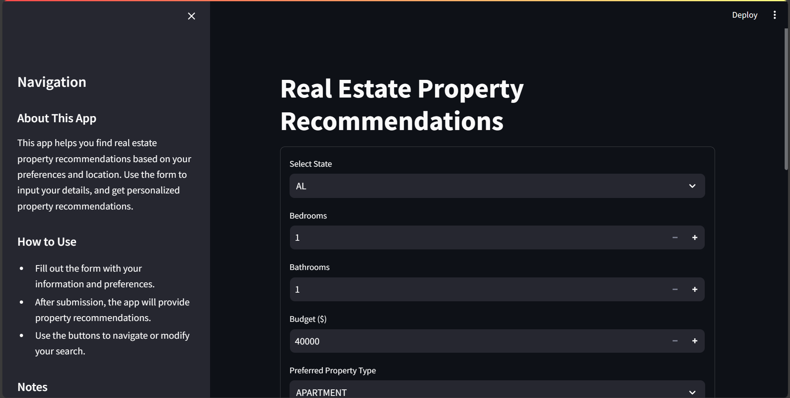
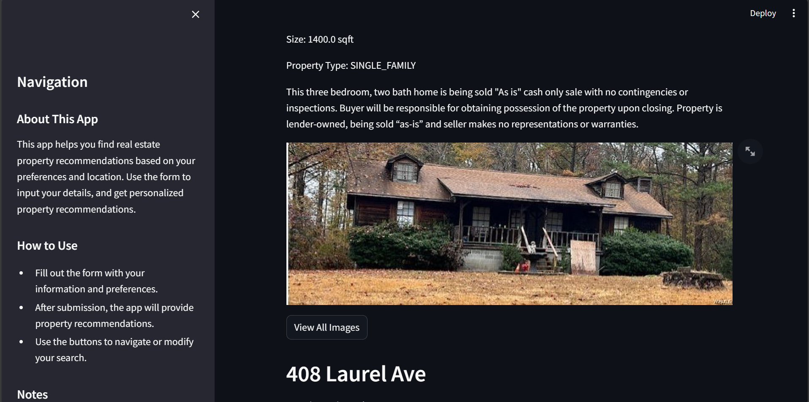
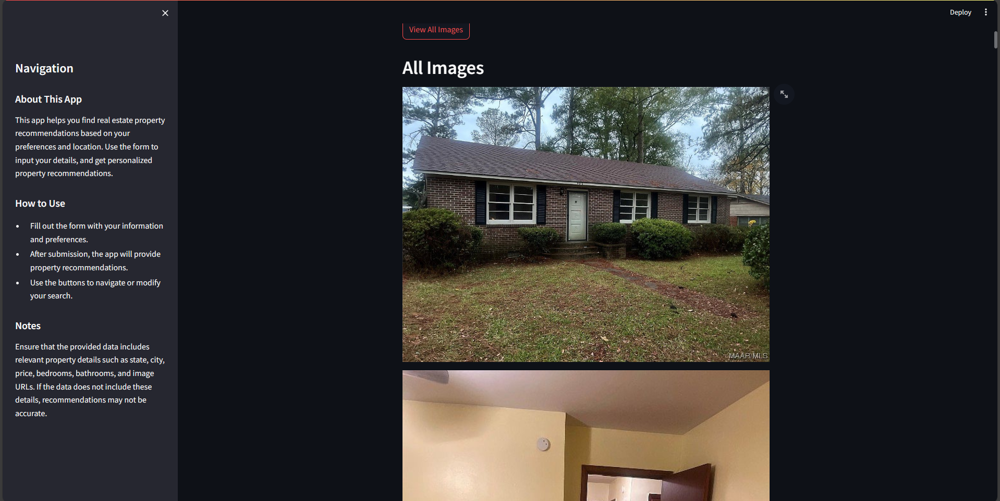
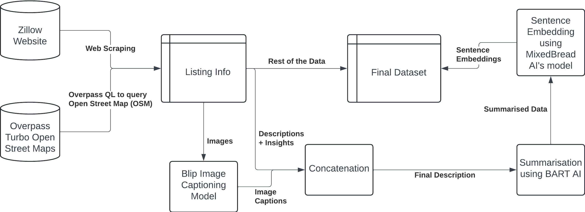
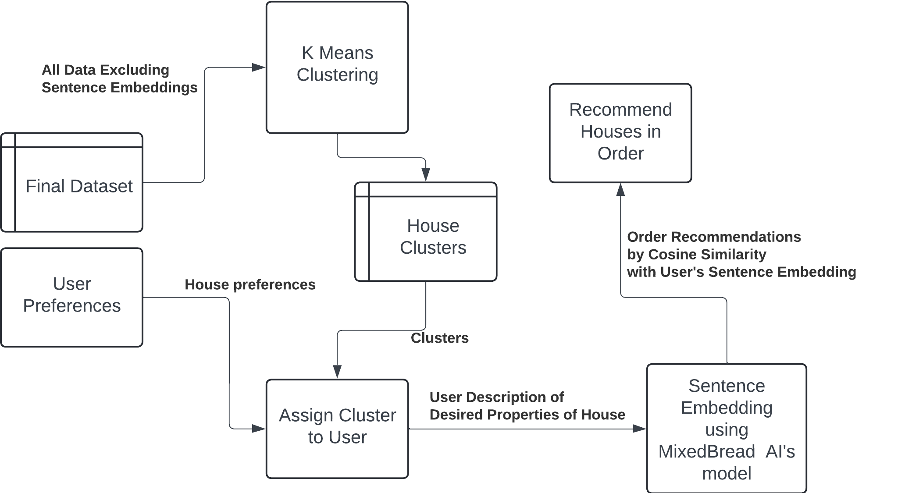

# Real Estate Recommendation System

## Instructions to Run the Code

Clone the project

```bash
  git clone https://link-to-project
```

Go to the project directory

```bash
  cd my-project
```
We recommend you to create a new environment using conda by using
```bash
    conda create -n <environment name>
    conda activate <environment name>
```
Once inside the environment install the libraires required used using

```bash
  pip install -r requirements.txt
```
Once all the dependencies are done start, the server
```bash
    cd Server
    python Server.py
```
This will open up the server that will run the necessary sentence embedding transformer model needed for embedding the house description given by the user.

Next we will run the ``Streamlit.py`` using ``streamlit`` to get the 
app running.
```bash
cd ..
streamlit run Streamlit.py
```
This will open up a new window in your default browser and the home page will show up which will look like this.




You will need to enter the details as per your requirement of the house in the form. You will be required to give a small description and then double click the ``Generate recommendation`` button.

The recommendations will show up on your screen like one shown below.





## Approach for Recommendation

### Dataset Creation

##### Data Acquisition

1. We first of all scraped the Zillow website to get listings info for 15 cities - New York City, Chicago, Los Angeles (LA), San Jose, Boston, Washington, D.C., Miami, Seattle, Houston, Dallas, Las Vegas, Atlanta, Philadelphia, Phoenix, Detroit.

2. This is done using the httpx, asyncio, parsel and BeautifulSoup libraries in Python. 

3. We end up with a total of 6936 listings of houses across the 15 cities, which serves as our initial dataset.

4. Each row has a number of attributes such as no. of bedrooms, bathrooms, price, estimated rent, house area, latitude, longitude, home insights (what all the house contains), house images and address info, and descriptions provided by the seller/real estate agent.

5. The code for the same is available in the AllListingInfo.ipynb file. We get JSON data from Zillow, and the code to convert it to a csv representation is available in CombinedFilter.ipynb.


##### Supplementing Data with Neighbourhood Info

1. Depending on the user, more than the house itself, the neighbourhood of the house may matter more. The user may value the connectivity of the house, with schools, leisure areas (parks, malls), shops and transit centers (bus stops, subway stations etc.) more than the house itself.

2. To take care of this, we queried the website Overpass Turbo, to get the info of schools, parks, malls (parks and malls are clubbed under “Leisure areas”), shops and transit centres in each of the 15 cities.

3. Then for each data point, we annotate it with the number of leisure areas, schools, shops (departmental stores etc) within 5 km and transit centres within 2 km. This can serve as a measure of how well connected the listing is in each of these areas, and can be compared with the user’s preferences for these values.

4. The following files contain the code to extract the relevant data obtained from the Overpass Turbo website - leisure.py, schools.py, shops.py, transit.py. 

5. The file Distance_comparer.py contains the code to merge this data with our listings data. 

##### Image Captioning and Description Concatenation

1. From the zillow website, we got a list of images for each of the listing. We saw that the description given on the zillow website wasn’t accurate for describing the house. More often than not, it included more info about the “Open Houses” for the listings, rather than the houses itself.

2. Hence we passed the images of each of the listing into a image captioning model to get more intricate details about the house. The info obtained from the description, image captions, and insights of the house are then concatenated to get a final long description of the house.

3. We used Blip Image Captioning model by Salesforce.

4. The code for the generation of captions is available in the ImageCaptions.ipynb file.

5. The code for combining descriptions is available in the Desc_Combiner.ipynb file.

##### Text Summarising

1. The descriptions thus obtained ranged from 1000 characters to even as large as 14000 characters. We were unable to work on this using any model.

2. Hence we first had to run a summariser model, which would take 1024 characters at a time from the description, and then create a summary for those characters, and then do the same for each chunk of 1024 characters in the description. 

3. Finally we just combined the summaries generated by each block, and get a final summary. This is done for each of the data points.

4. We used Facebook’s BART AI model for the summarisation. 

5. The code for text summarisation is available in the Summariser.ipynb file.

##### Sentence Embeddings

1. We find similarity between the embeddings of the sentences in our recommendation algorithm (the details of which are provided later). For this, we generate and store the sentence embeddings of the description summaries which we generated in the previous step.

2. While recommending, we ask the user small descriptions of what he would want in the house, and the embedding of this description would be compared with the stored embeddings that we have computed in this step, and houses which are most similar in embeddings are recommended. 

3. The embeddings are generated using MixedBreadAI’s mxbai-embed-large-v1 model.

4. The code for this is available in the Embedding.ipynb file.

##### Dataset Generation Workflow

Here is a flowchart representing the entire procedure used for dataset generation.





### Recommendation Algorithm

##### Algorithm

The recommendation algorithm works as follows :

1. From the final dataset, we exclude the description, then with the remaining data, we split it based on the state. 

2. For each state, we apply k-means++ clustering and determine the optimum k using the elbow method.

3. We find the sentence embeddings for each description and store it in a json file with key as the house id(zpid) and value as the embedding array. (Offline phase)

4. Once we have the clusters, we take the user input including description and state. We then find the appropriate cluster for the user.

5. We then find the sentence embedding for the user’s description and apply cosine similarity with the sentence embeddings of houses present in the cluster. 

6. The final recommendation is done by displaying the houses in the decreasing order of similarity score.

7. The code for the elbow method is available in KMeans++_elbow.ipynb, while the kmeans code itself is available in KMeans++.py.

##### Algorithm Workflow

Here is a flowchart representing the entire algorithm used for recommendation.



### Final Output

##### Application Overview

1. We have implemented an application to allow users to interact with our recommendation model. The frontend of the application is implemented using “streamlit” where we created 2 pages :
    1. A form page which takes the user input 
    2. The results page where the recommendations are displayed. The user can view the house details along with the images.

2. When we run the streamlit app, the application asks the user for the information on what all he expects from the house and ask him to give him a small description of the house he expects.

3. Our website, takes into account the details mentioned by the user and then provides the users with the list of recommendations. 

4. The user is first assigned an initial cluster according to his preferences. The houses in that cluster are recommended to the user.

5. The order of recommendations is decided by the similarity score between the description given by the user and the description of the houses.

6. We implemented a small flask backend to host the sentence embedding model. A POST request is sent to this backend when the user submits the form where the user’s description and the embeddings within the user’s cluster (computed in the offline phase) are sent to the backend.

7. Then the backend algorithm uses the transformer model to get the sentence embeddings of the user’s description and performs the cosine similarity. The output is returned to the user, in order of decreasing similarity with the user’s description.

8. The code for the server is available in the server directory, while the code for the Streamlit application is available in Streamlit.py.

## Features

1. Recommendations based on the user's input.
2. Images for each of the listing.
3. Fullscreen mode
4. Cross platform

## Tech Stack

1. **UI:** Streamlit
2. **Server:** Flask
3. **ML Models** - 
    1. [BLIP-Salesforce](https://arxiv.org/pdf/2201.12086),
    2. [BART-Facebook](https://arxiv.org/pdf/1910.13461),
    3. [mxbai-embed-large-v1 model - MixedBreadAI](https://huggingface.co/mixedbread-ai/mxbai-embed-large-v1).
    4. Jupyter Notebooks for KMeans etc.

## Authors

- [@M Srinivasan](https://github.com/Srini2404)
- [@Siddharth Kothari](https://github.com/siddharth-kothari9403)
- [@Kalyan Ram Munagala](https://github.com/KalyanRam1234)
- [@Sankalp Kothari](https://github.com/SankalpKothari0904)